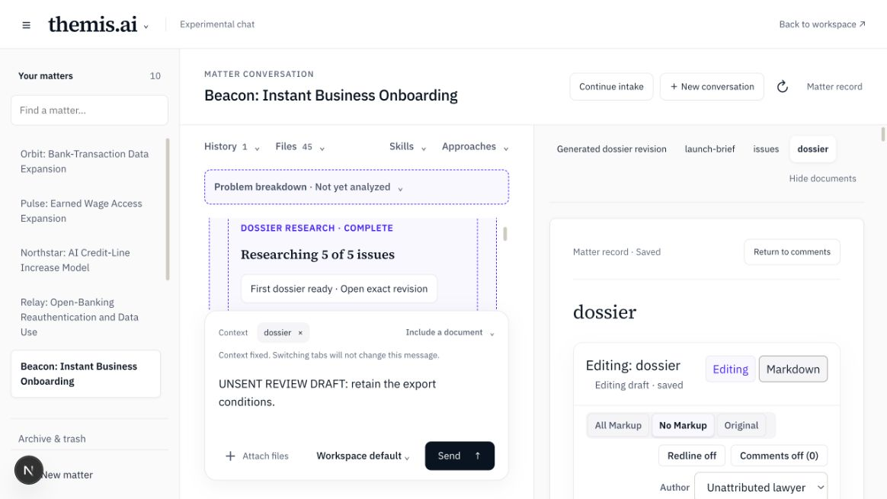

# Browser review results

Both chat surfaces were checked in the owned synthetic fixture. Detailed observations and limits are in verification.md. No paid provider was used.

| Evidence | Result |
|---|---|
| browser-01-setup.png / browser-02-three-workers.png | Three priorities, All-five choice and three active workers |
| browser-03-first-dossier.png | First exact dossier opened with later work still active |
| browser-04-launch-reference.png | First internal file link opened the supplied launch brief |
| browser-05-source-reference.png | External saved-passage click produced no visible source view; exact passage view remains unverified |
| browser-06-lawyer-edit.png / browser-07-completed-review.png | Saved UI edit and unsent draft retained during a review-required later publication |
| browser-08-reload.png | Draft, context, document layout and saved progress restored |
| browser-09-standard-setup.png / browser-10-standard-stopped.png | Standard setup and Stop control worked |
| browser-11-restarted-stopped.png / browser-12-standard-complete.png | Same-vault restart kept Stop; Resume reused IDs and completed |
| browser-13-standard-revision.png | Exact revision opened from standard chat |
| browser-14-preview.png | Hypothetical preview returned without new parent/revision or canonical change |
| browser-15-normal-chat.png | Ordinary chat returned a saved answer without new research |

The source counts, IDs and no-new-research assertions are backed by browser-*.json snapshots. The first request was DOR-20260912-1f3785 and the stopped/resumed second request was DOR-20260912-070c14. They have five and three unique child IDs respectively. The boundary counter counts provider entries across restart, so its total of 11 worker starts includes the three unfinished calls entered again after Stop; it is not a count of distinct child IDs or a claim of repeated completed calls.

The fixture writer supplies its own detailed prose. This proves display and routing, not content-preservation correctness. Independent tests expose the latter defect. Two internal file links are not proof of exact fact references.

